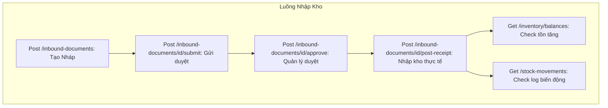
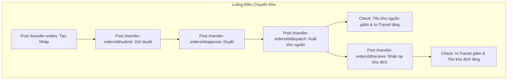
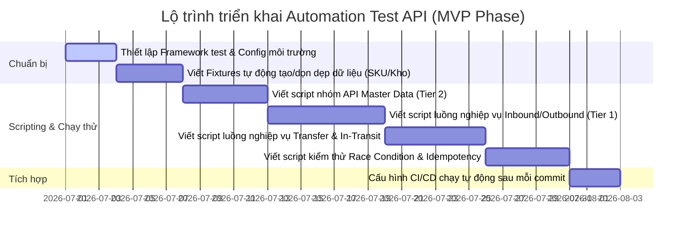

# Kế hoạch Kiểm thử Tự động hóa API (API Automation Testing Plan)
## Dự án: Hệ thống Quản lý Kho Đa tầng (Multi-Warehouse Management System - Module 2)

---

## 1. Mục tiêu chiến lược
Kiểm thử tự động hóa API cho Module Kho Đa tầng nhằm đảm bảo:
*   **Tính chính xác của tồn kho realtime:** Đảm bảo số lượng tồn kho khả dụng (Available) và tồn kho đang vận chuyển (In Transit) luôn được tính toán chính xác sau mỗi giao dịch.
*   **Tính toàn vẹn giao dịch (Transaction Integrity):** Đảm bảo cơ chế Row-level Lock hoạt động chính xác dưới tải cao, không phát sinh tồn kho âm hoặc sai lệch số liệu do Race Condition.
*   **Tính lặp lại (Idempotency):** Đảm bảo hệ thống chặn xử lý lặp khi client gửi trùng request (do timeout hoặc lỗi mạng) thông qua cơ chế `idempotency_key`.
*   **Kiểm soát luồng trạng thái (State Machine):** Đảm bảo chứng từ đi đúng quy trình nghiệp vụ (Nháp $\rightarrow$ Chờ duyệt $\rightarrow$ Đã duyệt $\rightarrow$ Hoàn tất / Hủy) và không thể nhảy cóc trạng thái.
*   **Bảo mật & Phân quyền (Security & Access Control):** Xác thực người dùng chỉ thao tác được trên các API và kho hàng được phân quyền.

---

## 2. Phân nhóm API & Mức độ ưu tiên tự động hóa (Automation Scope)

Dựa trên tài liệu đặc tả [doc.txt](file:///d:/auto/doc.txt), các API được phân thành 4 nhóm ưu tiên tự động hóa nhằm tối ưu hóa nguồn lực:

| Nhóm API | Các Endpoint tiêu biểu | Mức độ ưu tiên | Loại kiểm thử trọng tâm |
| :--- | :--- | :---: | :--- |
| **Nhóm 1: Nghiệp vụ Chứng từ & Thay đổi Tồn kho (Core Transactions)** | `/inbound-documents` (submit, approve, post-receipt, reject, cancel)<br>`/outbound-documents` (submit, approve, post-issue, reject, cancel)<br>`/transfer-orders` (submit, approve, dispatch, receive, return, reject, cancel) | **Tier 1 (Critical - 100%)** | Functional, Business Flow, Race Condition, Idempotency, Validation |
| **Nhóm 2: Thiết lập Master Data (Warehouses & Scopes)** | `/warehouses`<br>`/warehouses/{id}`<br>`/warehouses/{id}/enable`<br>`/warehouses/{id}/disable`<br>`/warehouse-scopes` | **Tier 2 (High - 90%)** | Functional, Security, Boundary, Data Relationship (Cây kho) |
| **Nhóm 3: Truy vấn & Báo cáo (Query & Reporting)** | `/inventory/balances`<br>`/in-transit-ledger`<br>`/stock-movements`<br>`/reports/inventory-xnt`<br>`/document-status-history` | **Tier 3 (Medium - 70%)** | Query performance, Filter & Search verification, Data reconciliation |
| **Nhóm 4: Tính năng ngoài MVP (Non-MVP)** | `/safe-stock-configs`<br>`/stock-requests`<br>`/inventory-snapshots` | **Tier 4 (Low - Tùy chọn)** | Chờ triển khai ở giai đoạn sau (Sau MVP) |

---

## 3. Các dạng/loại kiểm thử API cần triển khai

### 3.1. Kiểm thử chức năng cơ bản (Functional Validation)
*   **Positive Test (Kịch bản thành công):** 
    *   Tạo mới chứng từ thành công với đầy đủ dữ liệu hợp lệ.
    *   Cập nhật thông tin kho, thông tin chứng từ ở trạng thái cho phép (Nháp).
    *   Lấy chi tiết và danh sách chứng từ, kiểm tra cấu trúc JSON trả về.
*   **Negative Test (Kịch bản thất bại):**
    *   Gửi thiếu các trường bắt buộc (mã kho, SKU, số lượng, kho nhập/xuất).
    *   Gửi sai định dạng dữ liệu (số lượng âm, đơn giá âm, ký tự đặc biệt trong mã kho).
    *   Sửa đổi chứng từ đã được duyệt hoặc đã hoàn tất (hệ thống phải báo lỗi và chặn thao tác).

### 3.2. Kiểm thử luồng tích hợp nghiệp vụ (Business Flow / E2E API Testing)
Tự động hóa toàn bộ chuỗi API kế tiếp nhau mô phỏng thao tác thực tế của người dùng:





### 3.3. Kiểm thử Bảo mật & Phân quyền (Security & Auth API Testing)
*   **Xác thực (Authentication):** Gọi API khi không đính kèm Token, Token hết hạn, hoặc Token giả mạo $\rightarrow$ Hệ thống phải trả về mã lỗi `401 Unauthorized`.
*   **Phân quyền (RBAC - Role-based Access Control):**
    *   *Nhân viên kho* gọi API duyệt phiếu nhập/xuất/điều chuyển $\rightarrow$ Trả về `403 Forbidden`.
    *   *Quản lý kho* gọi API tạo/sửa kho $\rightarrow$ Trả về `403 Forbidden` (chỉ Admin/System Admin mới có quyền).
*   **Phạm vi dữ liệu (Data Scope Access):**
    *   Nhân viên được phân quyền tại Kho X gửi request tạo phiếu nhập/xuất tại Kho Y $\rightarrow$ Hệ thống chặn và trả về lỗi phân quyền dữ liệu.

### 3.4. Kiểm thử biên & Ràng buộc dữ liệu (Boundary & Constraint Testing)
*   **Validate tồn kho khả dụng:** Tạo phiếu xuất kho với số lượng xuất lớn hơn tồn khả dụng hiện tại $\rightarrow$ API phê duyệt hoặc API xuất thực tế phải trả về mã lỗi thích hợp và không thay đổi số lượng tồn kho.
*   **Thiết lập quan hệ cây kho:** 
    *   Tạo kho con với `kho_cha_id` không tồn tại.
    *   Tạo kho con chọn chính nó làm kho cha.
    *   Tạo quan hệ vòng lặp (Kho A làm cha Kho B, Kho B làm cha Kho C, Kho C làm cha Kho A) $\rightarrow$ API phải validate và chặn.
*   **Điều chuyển kho:** Tạo phiếu điều chuyển có `kho_nguồn` trùng với `kho_đích` $\rightarrow$ Chặn ngay từ API tạo phiếu.

### 3.5. Kiểm thử Race Condition & Concurrency (Tranh chấp tài nguyên)
Sử dụng các công cụ kiểm thử hiệu năng/tải để gửi đồng thời nhiều API request:
*   **Đồng thời xuất kho:** Gửi đồng thời 10 request xuất SKU A tại Kho X (ví dụ mỗi request xuất 15 sản phẩm, trong khi tồn khả dụng hiện tại là 100). Đảm bảo:
    *   Chỉ tối đa 6 request thành công (tổng xuất 90).
    *   4 request còn lại bị reject do thiếu tồn kho khả dụng.
    *   Không xảy ra hiện tượng tồn kho âm hoặc số liệu chênh lệch.
*   **Đồng thời điều chuyển và xuất kho:** 1 request xuất kho và 1 request điều chuyển cùng một SKU tại một kho gửi đi đồng thời. Đảm bảo transaction lock được thiết lập theo dòng (row-level lock) để tuần tự hóa việc trừ tồn kho, không gây race condition.

### 3.6. Kiểm thử tính Idempotency & Retry (Tính lặp giao dịch)
*   **Gọi trùng API tạo/xử lý chứng từ:**
    *   Gửi request thực hiện nhập kho (`post-receipt`) kèm theo một `idempotency_key` (UUID).
    *   Khi đang xử lý (hoặc đã xử lý xong nhưng client chưa nhận được response), gửi lại chính xác request đó (cùng payload và `idempotency_key`).
    *   **Kết quả mong đợi:** Hệ thống nhận biết request trùng, trả về kết quả đã xử lý của request trước đó, **không** cộng dồn tồn kho lần 2 và **không** tạo thêm bản ghi Stock Movement.
*   **Retry ghi Audit Log:**
    *   Mô phỏng (Mock) dịch vụ Audit Service bị gián đoạn mạng hoặc phản hồi chậm.
    *   Thực hiện nghiệp vụ kho (ví dụ duyệt phiếu nhập).
    *   **Kết quả mong đợi:** Module Kho thực hiện retry gửi log tới Audit Service theo cấu hình. Nếu hết số lần retry mà vẫn thất bại, hệ thống ghi nhận lỗi nghiệp vụ để tra soát nhưng không rollback transaction tồn kho đã hoàn tất thành công.

---

## 4. Kịch bản kiểm thử tự động hóa chi tiết (Detailed Test Scenarios)

### 4.1. Kịch bản cho luồng Nhập kho (Inbound Process)
1.  **TC-API-IN-01 (Positive):** Tạo phiếu nhập kho ở trạng thái `Nháp` $\rightarrow$ Validate HTTP 201, kiểm tra mã phiếu được sinh tự động, tồn kho chưa thay đổi.
2.  **TC-API-IN-02 (Boundary):** Tạo phiếu nhập kho với sản phẩm có SKU không tồn tại trong hệ thống $\rightarrow$ Validate HTTP 400 hoặc 422, thông báo lỗi sản phẩm không hợp lệ.
3.  **TC-API-IN-03 (State Machine):** Gửi duyệt phiếu nhập kho (chuyển trạng thái sang `Chờ duyệt`) $\rightarrow$ Sửa đổi thông tin chi tiết phiếu $\rightarrow$ Hệ thống báo lỗi (Không cho phép sửa phiếu khi ở trạng thái Chờ duyệt).
4.  **TC-API-IN-04 (Role Access):** Tài khoản nhân viên kho gửi request duyệt phiếu nhập kho $\rightarrow$ Hệ thống trả về lỗi 403.
5.  **TC-API-IN-05 (Positive):** Quản lý kho duyệt phiếu nhập $\rightarrow$ Trạng thái chuyển sang `Đã duyệt`. Kiểm tra tồn kho vẫn chưa thay đổi.
6.  **TC-API-IN-06 (Positive):** Thực hiện nhập kho thực tế cho phiếu đã duyệt $\rightarrow$ Trạng thái chuyển sang `Đã nhập kho`, tồn kho khả dụng (Available Stock) của sản phẩm tăng tương ứng, tạo 01 bản ghi Stock Movement với loại giao dịch là "Nhập kho".
7.  **TC-API-IN-07 (Idempotency):** Gửi lại request thực hiện nhập kho của phiếu trên $\rightarrow$ Hệ thống trả về kết quả cũ, không tăng thêm tồn kho.
8.  **TC-API-IN-08 (State Machine):** Thực hiện hủy phiếu nhập kho đã ở trạng thái `Đã nhập kho` $\rightarrow$ Hệ thống chặn và báo lỗi (Không được hủy phiếu đã hoàn tất).

### 4.2. Kịch bản cho luồng Xuất kho (Outbound Process)
1.  **TC-API-OUT-01 (Boundary):** Tạo phiếu xuất kho với số lượng xuất vượt quá tồn kho khả dụng hiện tại $\rightarrow$ Gửi duyệt $\rightarrow$ Duyệt phiếu xuất $\rightarrow$ Hệ thống validate tồn kho thất bại và trả về lỗi không đủ tồn kho khả dụng.
2.  **TC-API-OUT-02 (Positive Flow):** Tạo phiếu xuất kho với số lượng nhỏ hơn tồn khả dụng $\rightarrow$ Gửi duyệt $\rightarrow$ Phê duyệt $\rightarrow$ Thực hiện xuất kho thực tế $\rightarrow$ Trạng thái chuyển sang `Đã xuất kho`, tồn kho khả dụng giảm, ghi nhận Stock Movement loại "Xuất kho".
3.  **TC-API-OUT-03 (Idempotency):** Gọi lại API thực hiện xuất kho lần 2 $\rightarrow$ Hệ thống báo lỗi hoặc trả về kết quả cũ, không trừ tồn kho thêm.
4.  **TC-API-OUT-04 (Data Scope):** Thực hiện xuất kho từ Kho X nhưng kho này đã bị `Disable` (Ngừng hoạt động) $\rightarrow$ Hệ thống báo lỗi và chặn nghiệp vụ xuất.

### 4.3. Kịch bản cho luồng Điều chuyển kho (Transfer Process)
1.  **TC-API-TR-01 (Constraint):** Tạo phiếu điều chuyển giữa Kho A và Kho A (kho nguồn trùng kho đích) $\rightarrow$ API báo lỗi HTTP 400.
2.  **TC-API-TR-02 (Positive Flow - Phase 1: Xuất điều chuyển):**
    *   Tạo, duyệt phiếu điều chuyển từ Kho A sang Kho B.
    *   Gọi API xuất điều chuyển (`dispatch`) $\rightarrow$ Trạng thái phiếu chuyển sang `Đang vận chuyển`.
    *   Kiểm tra tồn kho qua API `/inventory/balances`: 
        *   Tồn khả dụng (Available) tại Kho A giảm.
        *   Tồn đang vận chuyển (In Transit) tăng tương ứng với số lượng điều chuyển.
        *   Tồn khả dụng tại Kho B chưa thay đổi.
3.  **TC-API-TR-03 (In Transit Constraint):** Dùng số lượng hàng đang ở trạng thái `In Transit` tại Kho B để tạo phiếu xuất kho hoặc phiếu điều chuyển tiếp đi Kho C $\rightarrow$ Hệ thống kiểm tra Available Stock và báo lỗi không đủ hàng (chặn không cho sử dụng hàng đang trên đường vận chuyển).
4.  **TC-API-TR-04 (Positive Flow - Phase 2: Nhận điều chuyển):**
    *   Gọi API nhận hàng (`receive`) tại Kho B.
    *   Trạng thái phiếu chuyển sang `Hoàn tất`.
    *   Kiểm tra tồn kho qua API `/inventory/balances`:
        *   Tồn In Transit giảm về 0.
        *   Tồn khả dụng tại Kho B tăng tương ứng.
        *   Ghi nhận Stock Movement cho cả kho nguồn (Điều chuyển xuất) và kho đích (Điều chuyển nhập).
5.  **TC-API-TR-05 (Return Flow - Trả lại điều chuyển):**
    *   Tạo luồng điều chuyển mới, xuất kho nguồn thành công (hàng đang In Transit).
    *   Gọi API trả lại điều chuyển (`return`) do kho đích từ chối nhận $\rightarrow$ Trạng thái phiếu chuyển sang `Bị trả lại` hoặc `Hoàn tất trả lại`.
    *   Kiểm tra tồn kho: Hàng In Transit giảm về 0, tồn khả dụng hoàn lại về kho nguồn ban đầu.

---

## 5. Phương pháp tối ưu hóa thiết kế kiểm thử tự động

Để bộ kiểm thử tự động chạy ổn định, nhanh chóng và dễ bảo trì, cần áp dụng các giải pháp tối ưu sau:

### 5.1. Quản lý dữ liệu kiểm thử (Test Data Isolation & Cleanup)
*   **Vấn đề:** Các kịch bản kiểm thử API làm thay đổi tồn kho thực tế. Nếu chạy liên tục, dữ liệu rác sẽ tăng lên và gây sai lệch kết quả của các lượt chạy sau.
*   **Giải pháp:**
    *   **Setup:** Mỗi test suite khi bắt đầu chạy sẽ tự động sinh các SKU test mới (ví dụ: `SKU-TEST-YYYYMMDD-XXXX`) và các Warehouse test mới qua API để đảm bảo môi trường sạch 100%.
    *   **Teardown (Dọn dẹp):** Sau khi test suite kết thúc (hoặc dùng block `finally`), tự động gọi API xóa hoặc disable các Warehouse/SKU test đã tạo để khôi phục trạng thái ban đầu của hệ thống.
    *   **Sử dụng Database Seeding:** Đối với môi trường CI/CD, có thể cấu hình chạy script reset database về trạng thái chuẩn trước mỗi lần khởi chạy test suite.

### 5.2. Tách biệt kiểm thử đọc (Read API) và ghi (Write API)
*   Các API truy vấn thông tin (`GET`) có thể chạy song song (Parallel execution) để giảm thời gian chạy test suite.
*   Các API ghi dữ liệu hoặc thay đổi tồn kho (`POST`, `PUT`, `DELETE`, `PATCH`) nên được chạy tuần tự (Sequential execution) hoặc phân nhóm theo SKU/Warehouse riêng biệt để tránh xung đột dữ liệu chéo giữa các test case.

### 5.3. Mocking các dịch vụ bên ngoài (External Service Mocks)
*   Chức năng Audit Log của module Kho phụ thuộc vào một dịch vụ dùng chung là **Audit Service**. Để kiểm thử API của Module Kho độc lập (không bị ảnh hưởng bởi sự cố của Audit Service), cần thiết lập Mock server (như WireMock hoặc dùng tính năng Mock của các framework test) để giả lập phản hồi của Audit Service (trả về 200 OK hoặc trả về lỗi 500/Timeout để test cơ chế Retry).

---

## 6. Lựa chọn công cụ & Mô hình kiến trúc đề xuất

### 6.1. Đề xuất Công cụ (Tool Stack)
*   **Ngôn ngữ chính:** Python (dễ đọc, thư viện phong phú) hoặc JavaScript/TypeScript (đồng bộ với công nghệ của dự án).
*   **Thư viện/Framework kiểm thử:**
    *   **PyTest (Python):** Hỗ trợ fixture mạnh mẽ để setup/teardown dữ liệu, chạy song song tốt.
    *   **Axios / SuperTest (Node.js):** Nếu chọn JavaScript, thích hợp viết các API test tích hợp gọn nhẹ.
*   **Kiểm thử tải & Concurrency (Race Condition):**
    *   **K6 (Grafana):** Viết script bằng JS, cực kỳ tối ưu về hiệu năng và bộ nhớ để giả lập hàng trăm request đồng thời gọi API xuất kho/điều chuyển kho để test race condition.
*   **Tích hợp CI/CD:** Chạy bộ test tự động thông qua GitHub Actions, GitLab CI, hoặc Jenkins sau mỗi lần Developer commit code mới lên nhánh phát triển.

### 6.2. Cấu trúc thư mục Test Suite đề xuất
```text
tests/
│
├── config/                  # Cấu hình môi trường (Dev, Staging, Token, API Base URL)
│   └── env_config.json
│
├── fixtures/                # Setup/Teardown dữ liệu test (Tạo SKU, Tạo Kho)
│   ├── warehouse_fixtures.py
│   └── product_fixtures.py
│
├── functional/              # Kiểm thử chức năng riêng lẻ (Tạo/Sửa/Xóa/Validate)
│   ├── test_warehouses.py
│   ├── test_inbound.py
│   └── test_outbound.py
│
├── integration/             # Kiểm thử luồng nghiệp vụ E2E
│   ├── test_inbound_flow.py
│   ├── test_outbound_flow.py
│   └── test_transfer_flow.py
│
├── concurrency/             # Kiểm thử tải & Race condition
│   └── k6_race_condition.js
│
└── security/                # Kiểm thử phân quyền RBAC & Data Scope
    └── test_api_security.py
```

---

## 7. Kế hoạch triển khai kiểm thử tự động


