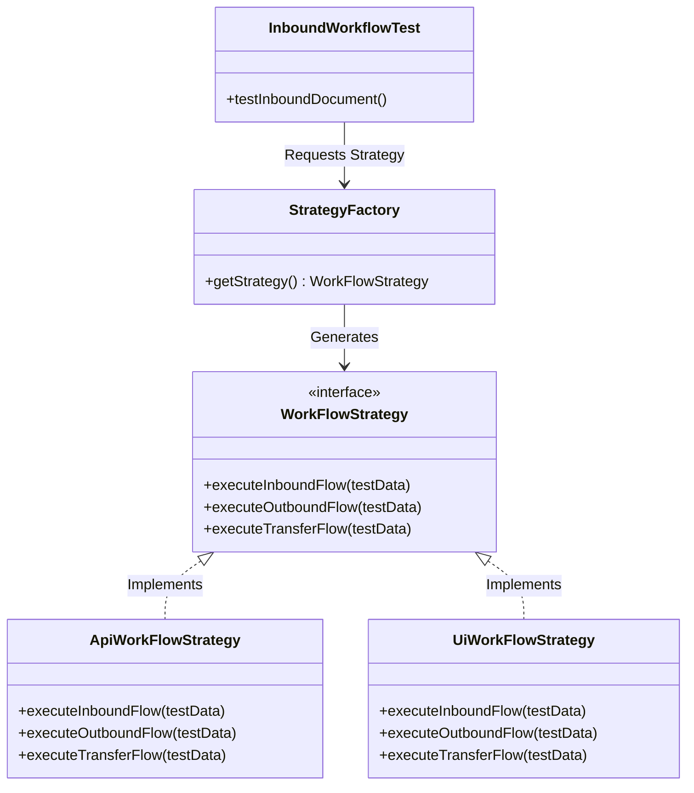

# Kiến Trúc Framework Kiểm Thử Tự Động Hóa (Selenium + RestAssured + Java)
## Thiết kế theo Strategy Pattern cho Đa Module và Đa Phương Thức (UI/API)

Tài liệu này trình bày chi tiết kiến trúc, mô hình thiết kế, cấu trúc thư mục và cách thức vận hành của Framework kiểm thử tự động hóa được xây dựng bằng **Java**, tích hợp **Selenium WebDriver** (cho UI) và **RestAssured** (cho API). 

Framework này được tối ưu hóa theo mô hình **Strategy Pattern** giúp tái sử dụng kịch bản kiểm thử (Test Cases), dễ dàng mở rộng thêm nhiều Module nghiệp vụ mới, và cho phép chuyển đổi linh hoạt giữa kiểm thử giao diện (UI) và kiểm thử backend (API) thông qua cấu hình hệ thống.

---

## 1. Các Nguyên Tắc Thiết Kế Cốt Lõi (Core Design Principles)

*   **Strategy Pattern (Linh hoạt phương thức chạy):** Định nghĩa một Interface chung đại diện cho các luồng nghiệp vụ. Kịch bản test chỉ gọi Interface này. Việc luồng test chạy qua UI (Selenium) hay qua API (RestAssured) sẽ được quyết định động thông qua cấu hình (`config.properties` hoặc Command Line Parameter).
*   **Factory Pattern (Khởi tạo đối tượng):** Sử dụng `DriverFactory` để quản lý khởi tạo trình duyệt (Chrome, Firefox, Edge, Headless Mode) và `StrategyFactory` để khởi tạo chiến lược kiểm thử tương ứng.
*   **ThreadLocal (Hỗ trợ chạy song song - Parallel Execution):** WebDriver và API Session được đóng gói trong `ThreadLocal` để đảm bảo an toàn luồng (Thread-safe) khi chạy song song nhiều test cases cùng lúc trên CI/CD.
*   **Page Object Model (POM - UI Testing):** Tách biệt mã kiểm thử và mã giao diện. Tất cả các tương tác với UI đều được bao bọc trong các Class Page.
*   **Singleton Pattern (Quản lý cấu hình toàn cục):** Đọc file cấu hình một lần duy nhất trong suốt vòng đời của Test Suite.
*   **Common Wrappers (Ngăn ngừa code trùng lặp):** Lớp `BasePage` chứa toàn bộ các hàm Selenium wrapper (chờ đợi thông minh, click, sendKeys, scroll, handle alert) để tránh việc viết đi viết lại mã Selenium thuần.

---

## 2. Mô hình Strategy Pattern hoạt động như thế nào?

Thay vì viết hai kịch bản test riêng biệt cho giao diện và API, chúng ta định nghĩa một giao diện nghiệp vụ chung:



Khi chạy test:
1.  Test class `InboundWorkflowTest` gọi `StrategyFactory.getStrategy()`.
2.  `StrategyFactory` đọc cấu hình `execution.type` (giá trị là `API` hoặc `UI`).
3.  Nếu là `API`, nó trả về instance của `ApiWorkFlowStrategy` (RestAssured thực thi).
4.  Nếu là `UI`, nó trả về instance của `UiWorkFlowStrategy` (Selenium thực thi).
5.  Test class chỉ cần gọi phương thức nghiệp vụ: `strategy.executeInboundFlow(testData)`. Kịch bản kiểm thử cực kỳ sạch và không chứa mã điều khiển Driver hay HTTP Request.

---

## 3. Cây Thư Mục Đầy Đủ Của Dự Án (Maven Standard Directory Layout)

Dưới đây là cấu trúc chi tiết, đầy đủ của toàn bộ mã nguồn framework. Các module nghiệp vụ mới (ví dụ: Module Bán hàng, Module Kế toán) chỉ cần cắm thêm vào các package `pages`, `strategy`, và `tests` theo mẫu sẵn có mà không cần sửa đổi phần nhân framework (core engine).

```text
auto/
├── pom.xml                                  # Cấu hình Maven dependencies (Selenium, RestAssured, TestNG)
├── testng.xml                               # Quản lý và cấu hình suite chạy kiểm thử
└── src/
    ├── main/
    │   └── java/
    │       └── com/
    │           └── auto/
    │               └── framework/
    │                   ├── config/          # Quản lý cấu hình hệ thống
    │                   │   └── ConfigReader.java
    │                   │
    │                   ├── driver/          # Quản lý WebDriver (Thread-safe)
    │                   │   ├── DriverFactory.java
    │                   │   └── DriverManager.java
    │                   │
    │                   ├── api/             # Lớp tiện ích gọi API (RestAssured helper)
    │                   │   └── ApiClient.java
    │                   │
    │                   ├── pages/           # Page Object Models (UI Testing)
    │                   │   ├── BasePage.java
    │                   │   ├── LoginPage.java
    │                   │   └── InboundPage.java
    │                   │
    │                   └── strategy/        # Thiết kế Strategy Pattern
    │                       ├── WorkFlowStrategy.java
    │                       ├── ApiWorkFlowStrategy.java
    │                       ├── UiWorkFlowStrategy.java
    │                       └── StrategyFactory.java
    │
    └── test/
        ├── java/
        │   └── com/
        │       └── auto/
        │           └── tests/
        │               ├── BaseTest.java    # Khởi chạy driver, session, dọn dẹp dữ liệu chung
        │               └── m2/              # Các bài test cho Module 2
        │                   └── InboundWorkflowTest.java
        │
        └── resources/
            ├── config.properties            # File cấu hình môi trường, tài khoản, chế độ chạy (UI/API)
            └── log4j2.xml                   # Cấu hình Log cho hệ thống
```

---

## 4. Chi tiết triển khai mã nguồn các file cốt lõi

### 4.1. File cấu hình dự án (`pom.xml`)
Cấu hình tất cả các thư viện cần thiết như Selenium, RestAssured, TestNG, Lombok (giảm thiểu boilerplate code), và ExtentReports (báo cáo trực quan).

[pom.xml](file:///d:/auto/pom.xml)

### 4.2. Quản lý cấu hình (`ConfigReader.java` & `config.properties`)
Giúp đọc các cấu hình như URL, trình duyệt, tài khoản, loại thực thi (UI/API) một lần duy nhất.

[config.properties](file:///d:/auto/src/test/resources/config.properties) | [ConfigReader.java](file:///d:/auto/src/main/java/com/auto/framework/config/ConfigReader.java)

### 4.3. Quản lý Driver song song (`DriverFactory.java` & `DriverManager.java`)
Đảm bảo mỗi Thread chạy test sở hữu một phiên trình duyệt WebDriver riêng biệt mà không bị xung đột tài nguyên.

[DriverFactory.java](file:///d:/auto/src/main/java/com/auto/framework/driver/DriverFactory.java) | [DriverManager.java](file:///d:/auto/src/main/java/com/auto/framework/driver/DriverManager.java)

### 4.4. API Client Wrapper (`ApiClient.java`)
Gói gọn thư viện RestAssured giúp gửi các yêu cầu GET/POST/PUT/DELETE ngắn gọn, tự động đính kèm `Header`, `Token` và `Idempotency-Key`.

[ApiClient.java](file:///d:/auto/src/main/java/com/auto/framework/api/ApiClient.java)

### 4.5. Page Object Base và các Page cụ thể (`BasePage.java`, `LoginPage.java`, `InboundPage.java`)
Cung cấp các hàm tương tác với trình duyệt an toàn (chờ cho tới khi element hiển thị rồi mới click/send key).

[BasePage.java](file:///d:/auto/src/main/java/com/auto/framework/pages/BasePage.java) | [LoginPage.java](file:///d:/auto/src/main/java/com/auto/framework/pages/LoginPage.java) | [InboundPage.java](file:///d:/auto/src/main/java/com/auto/framework/pages/InboundPage.java)

### 4.6. Lớp mẫu cho Strategy Pattern (`WorkFlowStrategy.java`, `ApiWorkFlowStrategy.java`, `UiWorkFlowStrategy.java`, `StrategyFactory.java`)
Phần quan quan trọng nhất của kiến trúc giúp phân tách chiến lược chạy kiểm thử UI và API.

[WorkFlowStrategy.java](file:///d:/auto/src/main/java/com/auto/framework/strategy/WorkFlowStrategy.java) | [ApiWorkFlowStrategy.java](file:///d:/auto/src/main/java/com/auto/framework/strategy/ApiWorkFlowStrategy.java) | [UiWorkFlowStrategy.java](file:///d:/auto/src/main/java/com/auto/framework/strategy/UiWorkFlowStrategy.java) | [StrategyFactory.java](file:///d:/auto/src/main/java/com/auto/framework/strategy/StrategyFactory.java)

### 4.7. Base Test và Test Case cụ thể (`BaseTest.java` & `InboundWorkflowTest.java`)
Lớp BaseTest quản lý toàn bộ vòng đời của suite test (khởi tạo trình duyệt, API session, teardown dọn dẹp dữ liệu rác). Các Test Class nghiệp vụ kế thừa lớp này sẽ vô cùng ngắn gọn và tập trung hoàn toàn vào luồng nghiệp vụ.

[BaseTest.java](file:///d:/auto/src/test/java/com/auto/tests/BaseTest.java) | [InboundWorkflowTest.java](file:///d:/auto/src/test/java/com/auto/tests/m2/InboundWorkflowTest.java)

---

## 5. Hướng Dẫn Mở Rộng Module Mới (Plugin New Module)

Khi phát triển thêm module mới (ví dụ: `Module 3 - Bán hàng (Outbound/Sales)`):

1.  **Bước 1:** Định nghĩa một Interface Strategy mới: `SalesWorkFlowStrategy`
    ```java
    public interface SalesWorkFlowStrategy {
        void executeSalesFlow(Map<String, Object> testData);
    }
    ```
2.  **Bước 2:** Viết các Class thực hiện Strategy đó:
    *   `ApiSalesStrategy` implements `SalesWorkFlowStrategy` (sử dụng `ApiClient` gọi endpoint bán hàng).
    *   `UiSalesStrategy` implements `SalesWorkFlowStrategy` (sử dụng các Page của module Bán hàng để click chọn sản phẩm, thanh toán).
3.  **Bước 3:** Tạo các Page Object cho UI (nếu có): `SalesPage`, `InvoicePage` kế thừa `BasePage`.
4.  **Bước 4:** Tạo Test Class: `SalesWorkflowTest` kế thừa `BaseTest`
    *   Gọi Factory để lấy Strategy.
    *   Truyền dữ liệu và gọi phương thức thực thi luồng.
    *   *Không cần viết lại Driver, Logger hay cấu hình cấu trúc framework.*

## 6. Hướng Dẫn chạy source code
*   `mvn clean test`
*   `mvn clean (để xoá log cũ)`
*   `mvn clean test -Dexecution.type=API`
*   `mvn clean test -Dexecution.type=UI`
*   `mvn clean test -Dexecution.type=UI -Dheadless=true`
*   `mvn clean test -DsuiteXmlFile=src/test/resources/testng.xml`
*   `mvn clean test -Dparallel=methods -DthreadCount=3`

## 7. Hướng Dẫn Thêm API Mới và Quản Lý Dữ Liệu Đầu Vào (Test Data)

### 7.1. Thêm API Mới
Khi muốn thêm các API mới vào luồng kiểm thử:
1. **Thao tác trực tiếp trên Strategy Class:** 
   * Mở class triển khai API Strategy tương ứng (ví dụ: [ApiWorkFlowStrategy.java](file:///d:/auto/src/main/java/com/auto/framework/strategy/ApiWorkFlowStrategy.java)).
   * Gọi các phương thức HTTP static từ [ApiClient.java](file:///d:/auto/src/main/java/com/auto/framework/api/ApiClient.java) như `ApiClient.post(...)`, `ApiClient.get(...)`, `ApiClient.put(...)` với URL path tương ứng.
2. **Thêm hàm Helper vào ApiClient (Nếu cần):**
   * Nếu có các logic API đặc thù cần xử lý trước/sau khi gửi hoặc tái sử dụng ở nhiều nơi (ví dụ: login lấy token, reset dữ liệu test), mở [ApiClient.java](file:///d:/auto/src/main/java/com/auto/framework/api/ApiClient.java) và khai báo thêm phương thức static mới tại đây.

### 7.2. Quản Lý Dữ Liệu Đầu Vào (Test Data)
Framework hỗ trợ 3 cách định nghĩa và quản lý dữ liệu đầu vào:

#### Cách 1: Sử dụng `Map<String, Object>` (Linh hoạt nhưng dễ sai chính tả)
Cấu trúc Key - Value thích hợp để khởi tạo nhanh dữ liệu test trong lòng test case.
```java
Map<String, Object> testData = new HashMap<>();
testData.put("warehouseCode", "WH-MAIN");
testData.put("sku", "SKU-IPHONE15");
testData.put("quantity", 50);
testData.put("price", 1200.0);
testData.put("idempotencyKey", UUID.randomUUID().toString());
```

#### Cách 2: Sử dụng Class Model / POJO (Khuyên dùng - Đảm bảo chặt chẽ và Auto-complete)
Định nghĩa một lớp Java Model đại diện cho bộ dữ liệu test của nghiệp vụ (ví dụ đặt trong package `com.auto.framework.models`):
```java
package com.auto.framework.models;

import lombok.Data;
import lombok.Builder;

@Data
@Builder
public class InboundTestData {
    private String warehouseCode;
    private String sku;
    private int quantity;
    private double price;
    private String idempotencyKey;
}
```
Khi viết test case, khởi tạo thông qua Builder Pattern:
```java
InboundTestData input = InboundTestData.builder()
    .warehouseCode("WH-MAIN")
    .sku("SKU-IPHONE15")
    .quantity(50)
    .price(1200.0)
    .build();
```

#### Cách 3: Định dạng File JSON ngoài (Khi chạy Data-driven Testing)
Tạo file `.json` ngoài (ví dụ lưu tại `src/test/resources/data/inbound_data.json`) để phân tách hoàn toàn mã nguồn kiểm thử và dữ liệu:
```json
{
  "warehouseCode": "WH-MAIN",
  "sku": "SKU-IPHONE15",
  "quantity": 50,
  "price": 1200.0,
  "idempotencyKey": "4c3b123d-0d67-4e08-9d2d-209f87cd8741"
}
```
Sử dụng thư viện **Jackson** để deserialize file JSON trên thành Java Object:
```java
ObjectMapper mapper = new ObjectMapper();
InboundTestData input = mapper.readValue(new File("src/test/resources/data/inbound_data.json"), InboundTestData.class);
```

#### Cách 4: Cấu hình môi trường toàn cục (Global Config)
Các cấu hình tĩnh, thông tin hệ thống (URLs, Browsers, Default credentials, Timeout, Mode chạy) được lưu trong [config.properties](file:///d:/auto/src/test/resources/config.properties) và truy vấn qua [ConfigReader.java](file:///d:/auto/src/main/java/com/auto/framework/config/ConfigReader.java).

## 8. Hướng Dẫn Viết Assertions (Kiểm tra kết quả) cho cả UI và API

Khi chạy cùng một kịch bản kiểm thử trên cả hai môi trường UI và API, việc kiểm tra kết quả (Assertions) cần được thiết kế khéo léo để đảm bảo tính trung lập và sạch sẽ của Test Class. Có hai cách tiếp cận chính:

### Cách 1: Assertions đặt trực tiếp trong từng Strategy Class (Khuyên dùng cho dữ liệu phản hồi đặc thù)
Cách này giúp tách biệt hoàn toàn kiểm thử dữ liệu backend (HTTP status, cấu trúc JSON) và giao diện frontend (Text hiển thị trên trình duyệt).

*   **Trong API Strategy (ví dụ [ApiWorkFlowStrategy.java](file:///d:/auto/src/main/java/com/auto/framework/strategy/ApiWorkFlowStrategy.java)):**
    ```java
    // Hứng response và kiểm tra HTTP Status Code
    Response createRes = ApiClient.post("/inbound-documents", staffToken, inboundPayload);
    Assert.assertEquals(createRes.getStatusCode(), 201, "API tạo phiếu nhập thất bại!");
    
    // Kiểm tra cấu trúc JSON hoặc trường dữ liệu trả về
    String status = createRes.jsonPath().getString("status");
    Assert.assertEquals(status, "Nháp", "Trạng thái phiếu mới tạo phải là Nháp!");
    ```
*   **Trong UI Strategy (ví dụ [UiWorkFlowStrategy.java](file:///d:/auto/src/main/java/com/auto/framework/strategy/UiWorkFlowStrategy.java)):**
    ```java
    // Đọc trạng thái hiển thị trên trình duyệt
    String statusText = inboundPage.getInboundStatus();
    Assert.assertEquals(statusText, "Đã nhập kho", "Trạng thái hiển thị trên giao diện bị sai!");
    ```

### Cách 2: Thiết kế hàm hứng trạng thái nghiệp vụ (State Verification - Tập trung Assert ở Test Class)
Thích hợp khi cậu muốn Test Class đóng vai trò kiểm soát chính và viết các câu lệnh Assert tập trung tại một nơi.

1. **Bước 1:** Bổ sung phương thức truy vấn trạng thái vào interface [WorkFlowStrategy.java](file:///d:/auto/src/main/java/com/auto/framework/strategy/WorkFlowStrategy.java):
   ```java
   public interface WorkFlowStrategy {
       String executeInboundFlow(Map<String, Object> testData);
       String getDocumentStatus(String documentId); // Hàm lấy trạng thái nghiệp vụ chung
   }
   ```
2. **Bước 2:** Cài đặt hàm này ở mỗi Strategy cụ thể:
   *   **Trong API Strategy:** Gửi API `GET /inbound-documents/{id}` và parse JSON để lấy trạng thái trả về.
   *   **Trong UI Strategy:** Dùng Selenium mở trang chi tiết phiếu và crawl text hiển thị trạng thái.
3. **Bước 3:** Viết Assert tập trung trong Test Class (ví dụ [InboundWorkflowTest.java](file:///d:/auto/src/test/java/com/auto/tests/m2/InboundWorkflowTest.java)):
   ```java
   String inboundId = strategy.executeInboundFlow(testData);
   
   // Gọi strategy lấy trạng thái (dưới API hay UI sẽ do strategy tự quyết định)
   String finalStatus = strategy.getDocumentStatus(inboundId);
   
   // Viết Assert tập trung tại Test Class
   Assert.assertEquals(finalStatus, "Đã nhập kho", "Nghiệp vụ hoàn tất nhưng trạng thái bị sai!");
   ```

## 9. Hướng Dẫn Xem Báo Cáo và Nhật Ký Kiểm Thử (Logs & Test Reports)

Sau khi chạy xong kiểm thử (bằng lệnh `mvn test` hoặc qua IDE), toàn bộ báo cáo và log chi tiết sẽ được tự động lưu trữ tại thư mục [target/surefire-reports/](file:///d:/auto/target/surefire-reports/). Dưới đây là cách truy cập và xem từng loại báo cáo:

### 9.1. Báo cáo HTML trực quan trên Trình duyệt (Khuyên dùng)
*   **Báo cáo chính (TestNG Suite Report):** Mở file [index.html](file:///d:/auto/target/surefire-reports/index.html) bằng trình duyệt (Chrome, Edge, Firefox).
    *   Để xem log in ra của từng bài test (như payload request, response body, các bước UI), click chọn **Reporter output** ở menu bên trái.
    *   Chọn **Times** để xem biểu đồ thời gian thực thi của từng test case.
*   **Báo cáo tóm tắt (Emailable Report):** Mở file [emailable-report.html](file:///d:/auto/target/surefire-reports/emailable-report.html). File này được thiết kế tối giản, hiển thị dưới dạng bảng tổng hợp Pass/Fail cực kỳ thích hợp để đính kèm gửi báo cáo nhanh.

### 9.2. Xem Nhật ký chạy dạng Text thuần (Plain Text Log)
Mỗi Test Class khi chạy sẽ được Surefire lưu toàn bộ log in ra màn hình Console (Console Output) vào một file `.txt` tương ứng trong thư mục báo cáo.
*   *Ví dụ:* File log của bài test kho là [com.auto.tests.m1.WarehouseTest.txt](file:///d:/auto/target/surefire-reports/com.auto.tests.m1.WarehouseTest.txt). Đây là nơi nhanh nhất để đọc các đoạn text log debug mà không cần mở giao diện HTML.

### 9.3. Nhật ký định dạng XML cho CI/CD
Nếu dự án được tích hợp chạy tự động trên Jenkins, GitLab CI, hoặc GitHub Actions:
*   File [TEST-com.auto.tests.m1.WarehouseTest.xml](file:///d:/auto/target/surefire-reports/TEST-com.auto.tests.m1.WarehouseTest.xml) sẽ lưu trữ log console bên trong khối CDATA của thẻ `<system-out>`.
*   File [testng-results.xml](file:///d:/auto/target/surefire-reports/testng-results.xml) chứa kết quả tổng hợp của toàn bộ suite để các server CI/CD đọc, phân tích và tự động vẽ biểu đồ trực quan lịch sử chạy test.

### 9.4. Dọn dẹp báo cáo và log cũ (Clear logs)
Trước khi chạy một lượt test mới, cậu nên chạy lệnh sau để xóa toàn bộ các tệp tin log và kết quả chạy cũ, tránh nhầm lẫn dữ liệu:
```bash
mvn clean
```